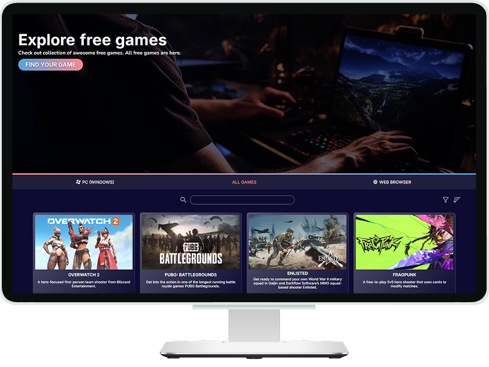
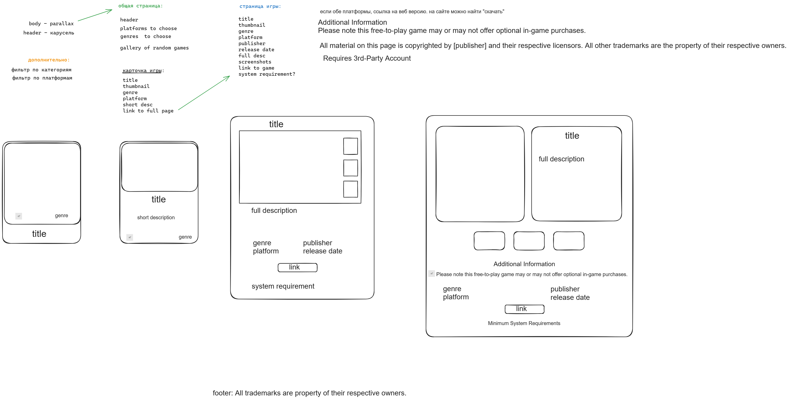

## Project name: Free Games

#### Group Project

### Project Goals:

- A website that displays information retrieved from an API AND/OR USES the information retrieved to display something.
- The page can have functionalities like searching for spesific information, randomising what information you are getting with a button click, etc. Its up to the group what you are going to do.

## 💎 Description

"Free games" is a group project using JavaScript to fetch and display free game data from an API. Features include search functionality, randomized game suggestions, and interactive elements for exploring available games. A dynamic and user-friendly experience for discovering free games!

### 🧩 Built With

<!-- end:tech-stack -->

### Contributors:

<a href="https://github.com/katerinabredihina" target="_blank" rel="noopener noreferrer">Kateryna</a>  
<a href="https://github.com/Inna-B10" target="_blank" rel="noopener noreferrer">Inna</a>

### 🚀 [View demo](https://inna-b10.github.io/Free-games/)

### <a href="https://excalidraw.com/#json=6XXL_ijyQlPHhZqyzC89p,iLjCXMkXgLPqkuwxy-Rs0A" target="_blank" rel="noopener noreferrer">Design sketch</a>

